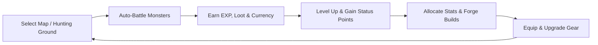

# ⚔️ Runevale

> **A lightweight isometric AFK RPG inspired by Ragnarok Online.**

[](https://www.typescriptlang.org/)
[](https://phaser.io/)
[](https://react.dev/)
[](https://nodejs.org/)
[](https://www.postgresql.org/)
[](LICENSE)

---

## 📖 Overview

**Runevale** is an isometric idle/AFK RPG crafted for players who cherish classic Ragnarok Online character progression, stat point theorycrafting, and monster grinding, but may not have endless hours to grind actively.

Dispatch your adventurer to hunting zones across the realm. Watch them battle in real-time or close the game and let offline progression compute your experience, zeny, and rare drops. Return to allocate status points, upgrade your equipment, refine your build, and unlock challenging new maps.

---

## 🎯 Game Goals & Philosophy

- **Satisfying Progression in Short Bursts**: Meaningful character growth whether you have 5 minutes or 5 hours.
- **Deep Ragnarok-Style Builds**: Genuine stat builds (STR, AGI, VIT, INT, DEX, LUK) that alter combat outcomes, cast times, ASPD, flee, and hit rates.
- **True Offline Progress**: Mathematical offline simulation engine calculating realistic kills, loot drops, exp, and consumable usage.
- **Solo-Dev Friendly MVP**: Scoped for sustainable iterative solo development without sacrificing quality.
- **Nostalgic Isometric Visuals**: Classic 2.5D isometric perspective with expressive 2D sprite animations and charming environments.

---

## 🔄 Core Gameplay Loop



1. **Deploy**: Choose a field or dungeon zone suited for your character's level and elemental match-up.
2. **Auto-Grind**: Your character automatically pathfinds, acquires targets, executes basic attacks and skills, and gathers loot.
3. **Rewards**: Gain Base EXP, Job EXP, Zeny (currency), and monster drops (cards, equipment, crafting materials).
4. **Build Crafting**: Level up to obtain Status Points and distribute them across the six core attributes.
5. **Itemization**: Equip weapons, armor, headgears, accessories, and socket cards to conquer harder maps.

---

## 📊 Character Stats & Combat System

Runevale preserves the beloved six-attribute system from Ragnarok Online:

| Stat | Primary Effects | Secondary / Derived Effects |
| :--- | :--- | :--- |
| **STR** (Strength) | Physical Attack Power (ATK), Melee damage bonus | Inventory weight capacity bonus |
| **AGI** (Agility) | Attack Speed (ASPD), Flee rate (Evasion) | Soft defense, motion delay reduction |
| **VIT** (Vitality) | Max HP, Physical Defense (Hard/Soft DEF) | HP potion recovery efficiency, status resistance (Stun, Poison) |
| **INT** (Intelligence) | Magic Attack (MATK), Max SP, Magic Defense (MDEF) | SP recovery rate, cast time reduction |
| **DEX** (Dexterity) | Hit Rate (Accuracy), Ranged weapon ATK | Variable cast time reduction, ASPD bonus, minimum damage floor |
| **LUK** (Luck) | Critical Rate (CRIT), Perfect Dodge | Minor ATK/MATK bonuses, status resistance (Curse, Silence) |

### Combat Mechanics Reference
- **Ruleset Choice**: Supports configurable damage formulas based on **Pre-Renewal** (pure stat-driven, fixed casting, DEF subtraction) or **Renewal** (percentage scaling, MATK ranges).
- **Stat Point Escalation**: Stat costs scale progressively as individual stats increase (e.g., raising STR from 98 to 99 costs significantly more status points than 10 to 11).
- **Separate & Testable Math Modules**: Combat formulas are decoupled into pure TypeScript functions covered by unit tests against verified RO damage tables.

---

## ⏳ AFK & Offline Progression

When you close the game, Runevale switches from visual sprite rendering to an **analytical simulation pipeline**:

- **Time Banking**: Tracks elapsed offline time up to a configurable cap (e.g., 8–12 hours, expandable via upgrades).
- **Kill-Per-Minute (KPM) Modeling**:
  $$\text{Kill Time} = \frac{\text{Monster HP}}{\text{Average DPS}} + \text{Search/Engage Delay}$$
- **Safety & Sustain Factor**: Compares character survivability (Flee + DEF + potion consumption) against monster density and damage output. If sustain drops to zero, the character safely retreats to town.
- **Welcome Back Summary Screen**: Displays total offline hours, monsters defeated, EXP gained, Zeny earned, item loot breakdown, and level-ups achieved.

---

## 🛠️ Technology Stack Options

You can build Runevale using modern web and game development stacks. Below are the recommended stacks and alternatives tailored for solo-developer efficiency.

### 🌟 Recommended Primary Stack

| Layer | Technology | Rationale |
| :--- | :--- | :--- |
| **Game Engine** | **[Phaser 3](https://phaser.io/)** | Battle-tested 2D/isometric canvas/WebGL engine. Excellent sprite animation, tilemap support, and lightweight asset loading. |
| **Language** | **[TypeScript](https://www.typescriptlang.org/)** | Shared types and interfaces across client and server for stats, monsters, items, and combat math. |
| **Client Bundler** | **[Vite](https://vitejs.dev/)** | Instant Hot Module Replacement (HMR), ultra-fast builds, and zero-config TypeScript compilation. |
| **UI Overlay** | **[React 18/19](https://react.dev/)** | Declarative DOM overlays on top of the Phaser canvas for menus, stat allocation windows, inventory grids, and offline summaries. |
| **State Management**| **[Zustand](https://github.com/pmndrs/zustand)** | Minimalist, fast state store to bridge React UI components with Phaser game events seamlessly. |
| **Backend API** | **[Node.js](https://nodejs.org/) + [Express](https://expressjs.com/)** *(or [Fastify](https://fastify.dev/))* | High-performance JSON REST API for user auth, cloud saves, and server-side offline calculations. |
| **Database & ORM** | **[PostgreSQL](https://www.postgresql.org/) + [Prisma](https://www.prisma.io/)** *(or [Drizzle ORM](https://orm.drizzle.team/))* | Relational schema integrity for inventories, character stats, and equipment slots with typed queries. |
| **Realtime (Future)**| **[Socket.IO](https://socket.io/)** | Ready for real-time chat, party sharing, or multiplayer towns when scaling beyond single-player. |

---

### 🔀 Alternative Stack Combinations

Depending on your design preferences, you can substitute components:

#### 1. Fullstack Monorepo (pnpm + Turborepo)
- **Shared Package (`@runevale/shared`)**: Houses pure combat formulas, stat calculations, item IDs, and validation schemas used by both client and server without code duplication.
- **Frontend (`@runevale/client`)**: React + Phaser + Vite.
- **Backend (`@runevale/server`)**: Node.js / Fastify / Express.

#### 2. Engine Alternatives
- **[PixiJS](https://pixijs.com/)**: If you want a more bespoke render pipeline and custom camera logic instead of Phaser’s built-in scene architecture.
- **[Godot Engine 4 (Web Export)](https://godotengine.org/)**: Ideal if you prefer a visual scene editor, tilemap tools, and dedicated 2.5D isometric tools out-of-the-box, exportable to HTML5/Wasm.

#### 3. Lightweight Backend / Serverless Options
- **[Supabase](https://supabase.com/)**: Instant Postgres database, Auth, row-level security, and Edge Functions—drastically cuts backend boilerplate for solo developers.
- **[SQLite (better-sqlite3 / LibSQL)](https://github.com/WiseLibs/better-sqlite3)**: Perfect for single-player local desktop distribution (via Electron or Tauri) before launching a central web server.

---

### 🎨 Asset & Design Toolchain

- **Tilemaps**: [Tiled](https://www.mapeditor.org/) or [LDtk](https://ldtk.io/) with isometric staggered/diamond projection.
- **Sprite Art & Animations**: [Aseprite](https://www.aseprite.org/) or [Pixelorama](https://orama-interactive.itch.io/pixelorama) for 8-direction or 4-direction character walk/attack cycles.
- **Visual Scene Design**: [Phaser Editor 2D](https://phasereditor2d.com/) for scene layout and asset pack management.

---

## 🚀 Initial MVP Roadmap

- [ ] **Isometric Playground**: 1 small isometric tilemap with player movement and camera bounds.
- [ ] **Player Entity**: 1 character class with 4-directional idle and walk animations.
- [ ] **Target Dummy / Poring Monster**: 1 spawnable monster with wandering AI and respawn timer.
- [ ] **Combat Core**: Basic auto-attack loop, hit/flee checks, damage numbers, and HP bars.
- [ ] **Character Sheet**: Base Level, EXP bar, STR/AGI/VIT/INT/DEX/LUK allocation modal.
- [ ] **Loot & Inventory**: Simple item drop system (Jellopy, Knife, Apple) and grid inventory.
- [ ] **Session Persistence**: LocalStorage save/load system for character progression.
- [ ] **Offline Progress Generator**: Calculates elapsed time between sessions and awards offline gains.

---

## 📁 Suggested Project Directory Structure

```text
runevale/
├── client/                     # Phaser + React game client
│   ├── index.html
│   ├── package.json
│   ├── vite.config.ts
│   ├── public/
│   │   └── assets/             # Spritesheets, tilemaps, SFX, fonts
│   │       ├── characters/
│   │       ├── monsters/
│   │       ├── maps/
│   │       └── ui/
│   └── src/
│       ├── main.tsx            # React & Phaser initialization entrypoint
│       ├── game/               # Pure Phaser game logic
│       │   ├── config.ts       # Phaser game configuration
│       │   ├── scenes/         # BootScene, PreloadScene, WorldScene
│       │   ├── entities/       # Player, Monster, DropItem
│       │   ├── combat/         # Client-side combat animations & FX
│       │   └── maps/           # Isometric map loaders & coordinate helpers
│       ├── ui/                 # React HUD overlay components
│       │   ├── CharacterSheet.tsx
│       │   ├── InventoryGrid.tsx
│       │   ├── OfflineModal.tsx
│       │   └── CombatLog.tsx
│       └── store/              # Zustand global state bridge
├── server/                     # Backend API & offline engine
│   ├── package.json
│   ├── tsconfig.json
│   └── src/
│       ├── server.ts           # Express/Fastify entry point
│       ├── routes/             # Auth, Character, Offline routes
│       ├── services/           # Save game & simulation services
│       ├── combat/             # Server-authoritative combat math
│       └── db/                 # Prisma / Database schema & migrations
├── shared/                     # Shared game data & math formulas
│   ├── types/                  # Player, Monster, Item, Stat types
│   ├── formulas/               # Damage, ASPD, Cast Time, EXP curves
│   └── constants/              # Base stats, drop rates, item definitions
└── README.md
```

---

## ⚡ Quickstart (Local Development)

### Prerequisites
- [Node.js](https://nodejs.org/) (v20+ recommended)
- [pnpm](https://pnpm.io/) or [npm](https://www.npmjs.com/)

### Installation & Run

```bash
# Clone the repository
git clone https://github.com/your-username/runevale.git
cd runevale

# Install dependencies (once project packages are initialized)
npm install

# Start client development server
npm run dev --prefix client

# Start server development server
npm run dev --prefix server
```

---

## 📜 License

Distributed under the **MIT License**. See `LICENSE` for more information.

---

*Inspired by Gravity's Ragnarok Online. Runevale is an independent project with original artwork, lore, and world design.*
